# Look AI — Database Design Document

> **Status:** Living reference · **Last verified:** 2026-08-10 (against the live project via Supabase MCP)
> **Backend:** Supabase (PostgreSQL) · **Auth:** Clerk (JWT → Supabase) · **Images:** Cloudinary + Supabase Storage

This document describes the **current, applied** database state of the Look AI app (React Native / Expo + Supabase). The authoritative source is the migration chain in `supabase/migrations/` (in particular the `20260808*` "complete schema" + cleanup migrations). See [§10 Migration history](#10-migration-history--sources-of-truth) for how the files relate.

---

## 1. Overview & architecture

| Layer           | Technology                                                    | Role                                                                 |
| --------------- | ------------------------------------------------------------- | -------------------------------------------------------------------- |
| App             | React Native / Expo SDK 54, TypeScript                        | Client (`src/`)                                                      |
| Auth            | **Clerk** (`@clerk/clerk-expo`)                               | Passwordless / Google SSO / email OTP. `user_id` = Clerk `sub` claim |
| Database        | **Supabase** (PostgreSQL, RLS)                                | Primary store, realtime, edge functions                              |
| Images          | **Cloudinary**                                                | All product/full-length/scan image hosting (URLs stored in DB)       |
| Storage buckets | **Supabase Storage**                                          | `try-on-uploads` (virtual try-on inputs)                             |
| AI              | **Google Gemini** via Supabase edge functions                 | Vision scans, label OCR, planner chat                                |
| Payments        | **RevenueCat SDK**                                            | Subscriptions/entitlements (no DB tables anymore)                    |
| Push            | Firebase Cloud Messaging (`@react-native-firebase/messaging`) | `fcm_token` column on `user_profiles`                                |
| Weather         | OpenWeatherMap (client fetch)                                 | Snapshot JSON persisted on events/outfits                            |

### Auth model

- There is **no Supabase `auth.users`** record — authentication is entirely Clerk.
- The Supabase client injects a Clerk-issued JWT (Clerk template named `"supabase"`) via the `accessToken` callback in `src/shared/supabase/client.ts`.
- `user_id` columns are `TEXT` = the Clerk `sub` claim (e.g. `user_2xxxxxxxxxx`).
- RLS policies check `(auth.jwt() ->> 'sub')::text = user_id::text`. The legacy `OR auth.uid()::text = user_id::text` branch was **removed by `20260810160812`**: `auth.uid()` casts the JWT `sub` claim to `uuid`, which throws `ERROR 22P02` for Clerk's text user ids (`user_…`) on every authenticated request. Clerk-only auth means there is never a Supabase `auth.users` record, so the branch was both broken and dead.
- `user_profiles` is the root entity; every other table FKs to `user_profiles(user_id)`.

### Storage strategy

- **Cloudinary** hosts almost all images (wardrobe items, community posts, saved labels, fit-check photos, full-length photos). The DB stores the resulting CDN URLs.
- **Supabase Storage** bucket `try-on-uploads` (public) is used for virtual try-on uploads.

---

## 2. Entity–Relationship diagram

```mermaid
erDiagram
    user_profiles ||--o{ wardrobe_items : owns
    user_profiles ||--o{ wear_logs : owns
    user_profiles ||--o{ logged_outfits : owns
    user_profiles ||--o{ ai_recommendations : owns
    user_profiles ||--o{ fit_check_analyses : owns
    user_profiles ||--o{ virtual_try_on_generations : owns
    user_profiles ||--o{ saved_labels : owns
    user_profiles ||--o{ user_gamification : owns
    user_profiles ||--o{ streak_logs : owns
    user_profiles ||--o{ planned_events : owns
    user_profiles ||--o{ community_posts : posts
    user_profiles ||--o{ post_likes : likes
    user_profiles ||--o{ post_reactions : reacts
    user_profiles ||--o{ post_saves : saves
    user_profiles ||--o{ post_comments : comments
    user_profiles ||--o{ notifications : recipient
    user_profiles ||--o{ notifications : actor
    user_profiles ||--o{ user_badges : awarded
    badges ||--o{ user_badges : granted
    wardrobe_items ||--o{ wear_logs : worn
    wardrobe_items ||--o{ outfit_items : part_of
    wardrobe_items ||--o{ ai_recommendation_items : suggested
    wardrobe_items ||--o{ virtual_try_on_generations : garment
    logged_outfits ||--o{ outfit_items : contains
    logged_outfits ||--o{ planned_events : suggested_outfit
    ai_recommendations ||--o{ ai_recommendation_items : lists
    community_posts ||--o{ post_likes : has
    community_posts ||--o{ post_reactions : has
    community_posts ||--o{ post_saves : has
    community_posts ||--o{ post_comments : has
    community_posts ||--o{ notifications : triggers
```



### Foreign-key graph (current)

```
user_profiles(user_id)
 ├─ wardrobe_items(user_id)  ── wear_logs(item_id)
 ├─ logged_outfits(user_id)   ── outfit_items(outfit_id → item_id → wardrobe_items)
 ├─ fit_check_analyses(user_id)
 ├─ virtual_try_on_generations(user_id, garment_item_id → wardrobe_items)
 ├─ saved_labels(user_id)
 ├─ ai_recommendations(user_id) ── ai_recommendation_items(recommendation_id → item_id)
 ├─ user_gamification(user_id PK)
 ├─ streak_logs(user_id)
 ├─ planned_events(user_id, suggested_outfit_id → logged_outfits)
 ├─ community_posts(user_id)
 │   ├─ post_likes(post_id, user_id)
 │   ├─ post_reactions(post_id, user_id)
 │   ├─ post_saves(post_id, user_id)
 │   └─ post_comments(post_id, user_id)
 ├─ analytics_logs (no FKs — app telemetry)
 └─ notifications(user_id, actor_id → user_profiles, post_id → community_posts)
```

---

## 3. Table reference

> **Convention:** `[]` = `TEXT[]` array. Defaults shown where meaningful. Columns marked ⚠️ are not in the applied schema or are drift-prone (see §10–11).

### 3.1 User

#### `user_profiles` — the root profile record

Created: `20260808000000` (cols `bio`/`about` later removed by `20260808040000`; `fcm_token` added by `20260719000000`).

| Column                      | Type                  | Notes                                                                         |
| --------------------------- | --------------------- | ----------------------------------------------------------------------------- |
| `id`                        | UUID PK               | Surrogate; **not** the join key to other tables                               |
| `user_id`                   | TEXT UNIQUE NOT NULL  | Clerk `sub`; the real business key                                            |
| `nickname`                  | VARCHAR(50)           |                                                                               |
| `username`                  | VARCHAR(50) UNIQUE    | Global availability via `check_username_available` RPC (⚠️ not in migrations) |
| `age`                       | INT `CHECK (10..120)` |                                                                               |
| `height`                    | INT `CHECK (50..260)` | cm                                                                            |
| `gender`                    | VARCHAR(20)           |                                                                               |
| `body_type`                 | VARCHAR(50)           |                                                                               |
| `style_preferences`         | TEXT[] `{}`           |                                                                               |
| `referral_sources`          | TEXT[] `{}`           | "where did you hear"                                                          |
| `avatar_url`                | TEXT                  | Cloudinary URL                                                                |
| `full_length_photos`        | TEXT[] `{}`           |                                                                               |
| `notifications_enabled`     | BOOL `true`           |                                                                               |
| `fcm_token`                 | TEXT                  | ⚠️ Added by `20260719000000`, **absent from `database.types.ts`**             |
| `is_active`                 | BOOL `true`           |                                                                               |
| `deleted_at`                | TIMESTAMPTZ           | Soft delete                                                                   |
| `created_at` / `updated_at` | TIMESTAMPTZ           | `updated_at` auto-bumped by trigger                                           |

**RLS:** SELECT `USING (true)` (profiles are publicly readable for the community feed); INSERT/UPDATE/DELETE owner-only.

**Indexes:** `user_id`, `username` (from `20260804205500`).

---

### 3.2 Wardrobe

#### `wardrobe_items` — the digital closet

| Column                          | Type                         | Notes                                            |
| ------------------------------- | ---------------------------- | ------------------------------------------------ |
| `id`                            | UUID PK                      |                                                  |
| `user_id`                       | TEXT NOT NULL                | FK → `user_profiles(user_id)`                    |
| `custom_name`                   | TEXT                         |                                                  |
| `brand`                         | TEXT                         |                                                  |
| `category`                      | TEXT NOT NULL                | 41 categories (top, bottoms, footwear, …)        |
| `sub_category`                  | TEXT                         |                                                  |
| `primary_color`                 | TEXT                         |                                                  |
| `color_hex`                     | VARCHAR(10)                  |                                                  |
| `secondary_colors`              | TEXT[] `{}`                  |                                                  |
| `pattern`                       | TEXT                         |                                                  |
| `fabric_guess`                  | TEXT                         |                                                  |
| `fit`                           | TEXT                         |                                                  |
| `sleeve_type` / `neck_type`     | TEXT                         |                                                  |
| `style` / `season` / `occasion` | TEXT[] `{}`                  | `season`/`occasion` have GIN indexes             |
| `formality_score`               | INT                          |                                                  |
| `versatility_tags`              | TEXT[] `{}`                  |                                                  |
| `rating`                        | INT `DEFAULT 5 CHECK (1..5)` |                                                  |
| `care_instructions`             | TEXT                         |                                                  |
| `notes`                         | TEXT                         |                                                  |
| `image_url`                     | TEXT NOT NULL                | Cloudinary (bg-removed)                          |
| `original_image_url`            | TEXT                         | Cloudinary original                              |
| `annotations`                   | JSONB `{}`                   | AI scan raw annotations                          |
| `confidence`                    | NUMERIC(3,2)                 | AI confidence                                    |
| `source`                        | TEXT `'manual'`              | camera / gallery / barcode / label_scan / manual |
| `is_favorite`                   | BOOL `false`                 |                                                  |
| `wear_count`                    | INT `0`                      | Denormalized counter                             |
| `last_worn_date`                | DATE                         |                                                  |
| `created_at` / `updated_at`     | TIMESTAMPTZ                  |                                                  |

⚠️ **Legacy columns** added by `20260715000000` and never dropped, but **no longer written/read** by app code or the complete schema: `bg_removed_image_url`, `raw_ai_data`, `cloth_color`, `scan_source`. May still exist in the live DB.

**RLS:** SELECT/INSERT/UPDATE/DELETE owner-only.
**Indexes:** `(user_id, category)`, `(user_id, wear_count DESC)`, `user_id`, GIN `season`, GIN `occasion`, `category` (from `20260715000000` / `20260804205500`).

#### `wear_logs` — one row per worn item

| Column    | Type                | Notes                                                                                                               |
| --------- | ------------------- | ------------------------------------------------------------------------------------------------------------------- |
| `id`      | UUID PK             |                                                                                                                     |
| `user_id` | TEXT NOT NULL       | FK → `user_profiles(user_id)`                                                                                       |
| `item_id` | UUID NOT NULL       | FK → `wardrobe_items(id)` ON DELETE CASCADE                                                                         |
| `worn_at` | TIMESTAMPTZ `NOW()` | ⚠️ `schema.sql` had `DATE` + `occasion`/`rating` — those were removed in the redesign; current migration is minimal |

**RLS:** owner-only.
**Indexes:** `(user_id, worn_at DESC)`.

#### `logged_outfits` — an outfit actually worn on a date

| Column                               | Type                 | Notes                                      |
| ------------------------------------ | -------------------- | ------------------------------------------ |
| `id`                                 | UUID PK              |                                            |
| `user_id`                            | TEXT NOT NULL        | FK → `user_profiles(user_id)`              |
| `date`                               | DATE NOT NULL        |                                            |
| `title`                              | TEXT NOT NULL        |                                            |
| `worn_time`                          | TIME NOT NULL        |                                            |
| `item_count`                         | INT `1`              |                                            |
| `score`                              | INT `CHECK (0..100)` | ⚠️ `schema.sql` variant was `NUMERIC(3,1)` |
| `description`                        | TEXT                 |                                            |
| `occasion`                           | TEXT                 |                                            |
| `weather_condition` / `weather_temp` | TEXT                 |                                            |
| `image_url`                          | TEXT                 | Cloudinary                                 |
| `is_planned`                         | BOOL `false`         |                                            |
| `created_at`                         | TIMESTAMPTZ          |                                            |

⚠️ `src/app/(root)/calendar.tsx:441` reads `row.items_worn`, which **exists in no schema** — the app layer joins `outfit_items`/`wardrobe_items` instead.

**RLS:** owner-only.
**Indexes:** `(user_id, date DESC)`.

#### `outfit_items` — junction: logged_outfit ↔ wardrobe item

| Column       | Type          | Notes                                       |
| ------------ | ------------- | ------------------------------------------- |
| `id`         | UUID PK       |                                             |
| `outfit_id`  | UUID NOT NULL | FK → `logged_outfits(id)` ON DELETE CASCADE |
| `item_id`    | UUID NOT NULL | FK → `wardrobe_items(id)` ON DELETE CASCADE |
| `created_at` | TIMESTAMPTZ   |                                             |
|              |               | `UNIQUE(outfit_id, item_id)`                |

**RLS:** owner-only via `EXISTS` on parent `logged_outfits` (in the applied `20260808000000` migration). Note: the older `schema.sql` used `USING (true)` — **do not** copy that; the migration version is the live one.

---

### 3.3 AI features

#### `ai_recommendations` — daily AI outfit suggestions

| Column            | Type                                                 | Notes                         |
| ----------------- | ---------------------------------------------------- | ----------------------------- |
| `id`              | UUID PK                                              |                               |
| `user_id`         | TEXT NOT NULL                                        | FK → `user_profiles(user_id)` |
| `suggested_date`  | DATE NOT NULL `CURRENT_DATE`                         |                               |
| `occasion`        | VARCHAR(50)                                          |                               |
| `weather_context` | JSONB `{}`                                           |                               |
| `outfit_score`    | INT `CHECK (0..100)`                                 |                               |
| `style_advice`    | TEXT                                                 |                               |
| `feedback`        | VARCHAR(20) `CHECK (liked\|disliked\|neutral\|worn)` |                               |
| `created_at`      | TIMESTAMPTZ                                          |                               |

**RLS:** owner-only. **Note:** this table is currently **not written** by any edge function or app path — see §10 note about the planner.

#### `ai_recommendation_items` — items inside a recommendation

| Column              | Type          | Notes                                           |
| ------------------- | ------------- | ----------------------------------------------- |
| `id`                | UUID PK       |                                                 |
| `recommendation_id` | UUID NOT NULL | FK → `ai_recommendations(id)` ON DELETE CASCADE |
| `item_id`           | UUID NOT NULL | FK → `wardrobe_items(id)` ON DELETE CASCADE     |
| `slot_category`     | VARCHAR(50)   | e.g. top/bottom/…                               |
| `created_at`        | TIMESTAMPTZ   | `UNIQUE(recommendation_id, item_id)`            |

**RLS:** owner-only via `EXISTS` on parent `ai_recommendations`.

#### `fit_check_analyses` — AI fit-check scan results

| Column                                     | Type                  | Notes                         |
| ------------------------------------------ | --------------------- | ----------------------------- |
| `id`                                       | UUID PK               |                               |
| `user_id`                                  | TEXT NOT NULL         | FK → `user_profiles(user_id)` |
| `image_url`                                | TEXT NOT NULL         | Cloudinary                    |
| `overall_score`                            | NUMERIC(3,1) NOT NULL |                               |
| `color_harmony_score` / `proportion_score` | INT                   |                               |
| `formality_tag`                            | VARCHAR(50)           |                               |
| `style_tags`                               | TEXT[] `{}`           |                               |
| `feedback_notes`                           | TEXT                  |                               |
| `strengths` / `improvements`               | TEXT[] `{}`           |                               |
| `created_at`                               | TIMESTAMPTZ           |                               |

**RLS:** owner-only. **Index:** `(user_id, created_at DESC)`.

#### `virtual_try_on_generations` — VTO job + result

| Column                      | Type                                                                     | Notes                                        |
| --------------------------- | ------------------------------------------------------------------------ | -------------------------------------------- |
| `id`                        | UUID PK                                                                  |                                              |
| `user_id`                   | TEXT NOT NULL                                                            | FK → `user_profiles(user_id)`                |
| `garment_item_id`           | UUID                                                                     | FK → `wardrobe_items(id)` ON DELETE SET NULL |
| `garment_image_url`         | TEXT NOT NULL                                                            |                                              |
| `model_image_url`           | TEXT NOT NULL                                                            |                                              |
| `result_image_url`          | TEXT                                                                     |                                              |
| `status`                    | VARCHAR(20) `'pending'` `CHECK (pending\|processing\|completed\|failed)` | ⚠️ `schema.sql` default was `'completed'`    |
| `pose_type`                 | VARCHAR(50) `'standing_front'`                                           |                                              |
| `error_message`             | TEXT                                                                     |                                              |
| `created_at` / `updated_at` | TIMESTAMPTZ                                                              |                                              |

**RLS:** owner-only. **Index:** `(user_id, created_at DESC)`. The `virtual-try-on` edge function (fal.ai) writes here.

#### `saved_labels` — care-label scans

| Column                                                                                                       | Type          | Notes                                                          |
| ------------------------------------------------------------------------------------------------------------ | ------------- | -------------------------------------------------------------- |
| `id`                                                                                                         | UUID PK       |                                                                |
| `user_id`                                                                                                    | TEXT NOT NULL | FK → `user_profiles(user_id)`                                  |
| `image_url`                                                                                                  | TEXT NOT NULL | Cloudinary                                                     |
| `brand`                                                                                                      | TEXT          | ⚠️ `schema.sql` named it `brand_name`                          |
| `size`                                                                                                       | VARCHAR(30)   | ⚠️ `schema.sql` named it `size_text`                           |
| `fabric_composition`                                                                                         | JSONB `[]`    |                                                                |
| `care_symbols`                                                                                               | JSONB `[]`    |                                                                |
| `wash_instruction` / `dry_instruction` / `iron_instruction` / `bleach_instruction` / `dry_clean_instruction` | TEXT          | ⚠️ `schema.sql` had different names (`washing_instruction`, …) |
| `original_text` / `translated_text` / `label_standard_guess`                                                 | TEXT          |                                                                |
| `created_at` / `updated_at`                                                                                  | TIMESTAMPTZ   |                                                                |

**RLS:** owner-only. **Index:** `(user_id, created_at DESC)`. Written by `src/features/scanning/api/save-label.ts`.

---

### 3.4 Gamification & streaks

#### `user_gamification` — per-user streak/score counters

| Column                      | Type                     | Notes                                           |
| --------------------------- | ------------------------ | ----------------------------------------------- |
| `user_id`                   | TEXT PK                  | FK → `user_profiles(user_id)` ON DELETE CASCADE |
| `current_streak`            | INT `0`                  |                                                 |
| `longest_streak`            | INT `0`                  |                                                 |
| `streak_freezes_available`  | INT `1`                  | ⚠️ `schema.sql` had default `2`                 |
| `style_score`               | INT `0` `CHECK (0..100)` | ⚠️ `schema.sql` had default `100`               |
| `last_logged_date`          | DATE                     |                                                 |
| `total_outfits_logged`      | INT `0`                  |                                                 |
| `created_at` / `updated_at` | TIMESTAMPTZ              |                                                 |

**RLS:** owner-only. Written by `useStreakSync` (`src/features/streaks/api/useStreakSync.ts`).

#### `streak_logs` — one activity record per day per user

| Column          | Type                          | Notes                                                              |
| --------------- | ----------------------------- | ------------------------------------------------------------------ |
| `id`            | UUID PK                       |                                                                    |
| `user_id`       | TEXT NOT NULL                 | FK → `user_profiles(user_id)`                                      |
| `activity_date` | DATE NOT NULL                 |                                                                    |
| `activity_type` | VARCHAR(50) `'outfit_logged'` | values: `outfit_logged`, `app_open`, `scan_mode`, `virtual_try_on` |
| `created_at`    | TIMESTAMPTZ                   | `UNIQUE(user_id, activity_date)`                                   |

**RLS:** owner-only. **Index:** `(user_id, activity_date DESC)`. Upserted on app-open in `src/app/(root)/_layout.tsx`.

#### `badges` + `user_badges` — lookup + junction (currently **unused by app code**)

| `badges`                    | Type | `user_badges`                                              | Type |
| --------------------------- | ---- | ---------------------------------------------------------- | ---- |
| `id` UUID PK                |      | `id` UUID PK                                               |      |
| `name` TEXT UNIQUE NOT NULL |      | `user_id` TEXT NOT NULL → `user_profiles(user_id)` CASCADE |      |
| `description` TEXT NOT NULL |      | `badge_id` UUID NOT NULL → `badges(id)` CASCADE            |      |
| `icon_url` TEXT NOT NULL    |      | `awarded_at` TIMESTAMPTZ                                   |      |
| `created_at` TIMESTAMPTZ    |      | `UNIQUE(user_id, badge_id)`                                |      |

**RLS:** `badges` select-all (public); `user_badges` owner-only.

> Created by `20260730000000`. The UI "badges" are currently a **local static mock** (`score.tsx`) — no DB writes.

---

### 3.5 Calendar / planning

#### `planned_events` — scheduled occasions/outfits

| Column                | Type                                                     | Notes                                                                                                                                                                                                     |
| --------------------- | -------------------------------------------------------- | --------------------------------------------------------------------------------------------------------------------------------------------------------------------------------------------------------- |
| `id`                  | UUID PK                                                  |                                                                                                                                                                                                           |
| `user_id`             | TEXT NOT NULL                                            | FK → `user_profiles(user_id)`                                                                                                                                                                             |
| `event_date`          | DATE NOT NULL                                            |                                                                                                                                                                                                           |
| `event_time`          | TIME                                                     |                                                                                                                                                                                                           |
| `occasion_label`      | TEXT NOT NULL                                            |                                                                                                                                                                                                           |
| `location`            | TEXT                                                     |                                                                                                                                                                                                           |
| `weather_snapshot`    | JSONB                                                    | OpenWeather snapshot                                                                                                                                                                                      |
| `suggested_outfit_id` | UUID                                                     | ⚠️ FK → `logged_outfits(id)` SET NULL in `20260808000000`, **but** `20260721000000` created it as `TEXT` and `ADD COLUMN IF NOT EXISTS` is a no-op if present → actual type/FK depends on migration order |
| `status`              | VARCHAR(20) `'tentative'` `CHECK (tentative\|confirmed)` |                                                                                                                                                                                                           |
| `created_at`          | TIMESTAMPTZ                                              |                                                                                                                                                                                                           |

**RLS:** owner-only. **Index:** `(user_id, event_date)`. Written by planner chat (`src/app/(root)/(ai-features)/planner-chat.tsx`).

---

### 3.6 Social / community

#### `community_posts` — explore feed posts

| Column        | Type          | Notes                                                                          |
| ------------- | ------------- | ------------------------------------------------------------------------------ |
| `id`          | UUID PK       |                                                                                |
| `user_id`     | TEXT NOT NULL | FK → `user_profiles(user_id)`                                                  |
| `image_url`   | TEXT NOT NULL | Cloudinary                                                                     |
| `caption`     | TEXT          |                                                                                |
| `style_tag`   | VARCHAR(50)   | ⚠️ older `schema.sql` had `style_tags TEXT[]`                                  |
| `occasion`    | VARCHAR(50)   |                                                                                |
| `likes_count` | INT `0`       | Denormalized; ⚠️ `comments_count`/`is_public` existed in old `schema.sql` only |
| `created_at`  | TIMESTAMPTZ   |                                                                                |

**RLS:** SELECT `USING (true)` (public feed); INSERT/UPDATE/DELETE owner-only.
**Indexes:** `(created_at DESC)`, `user_id` (from `20260804205500`). Realtime channel `public:community_posts`.

#### `post_likes` — simple like (⚠️ no CREATE in any migration — only in `schema.sql`)

| Column       | Type          | Notes                                           |
| ------------ | ------------- | ----------------------------------------------- |
| `id`         | UUID PK       |                                                 |
| `post_id`    | UUID NOT NULL | FK → `community_posts(id)` ON DELETE CASCADE    |
| `user_id`    | TEXT NOT NULL | FK → `user_profiles(user_id)` ON DELETE CASCADE |
| `created_at` | TIMESTAMPTZ   | `UNIQUE(post_id, user_id)`                      |

**RLS:** SELECT/INSERT/DELETE owner-only (recreated by `20260810110000` — gap #8 fixed, verified live 2026-08-10). Overlaps `post_reactions` with `reaction_type='like'` (§11).

#### `post_reactions` — multi-reaction (emoji)

| Column          | Type                 | Notes                                                                                                                   |
| --------------- | -------------------- | ----------------------------------------------------------------------------------------------------------------------- |
| `id`            | UUID PK              |                                                                                                                         |
| `post_id`       | UUID NOT NULL        | FK → `community_posts(id)` ON DELETE CASCADE                                                                            |
| `user_id`       | TEXT NOT NULL        | FK → `user_profiles(user_id)` ON DELETE CASCADE                                                                         |
| `reaction_type` | VARCHAR(30) NOT NULL | `🔥 👍 😂 ❤️ …`                                                                                                         |
| `created_at`    | TIMESTAMPTZ          | `UNIQUE(post_id, user_id, reaction_type)` (multi-reaction, changed by `20260810093000`; was `UNIQUE(post_id, user_id)`) |

**RLS:** SELECT `USING (true)`; INSERT/UPDATE/DELETE owner-only. **Indexes:** `post_id`, `user_id`. Triggers here drive `notifications` (§8).

#### `post_saves` — saved/bookmarked posts

| Column       | Type          | Notes                                           |
| ------------ | ------------- | ----------------------------------------------- |
| `id`         | UUID PK       |                                                 |
| `post_id`    | UUID NOT NULL | FK → `community_posts(id)` ON DELETE CASCADE    |
| `user_id`    | TEXT NOT NULL | FK → `user_profiles(user_id)` ON DELETE CASCADE |
| `created_at` | TIMESTAMPTZ   | `UNIQUE(post_id, user_id)`                      |

**RLS:** SELECT `USING (true)` [public]; INSERT/DELETE owner-only (per `20260808010000`; old `schema.sql` had owner select).

#### `post_comments` — post comments

| Column       | Type          | Notes                                           |
| ------------ | ------------- | ----------------------------------------------- |
| `id`         | UUID PK       |                                                 |
| `post_id`    | UUID NOT NULL | FK → `community_posts(id)` ON DELETE CASCADE    |
| `user_id`    | TEXT NOT NULL | FK → `user_profiles(user_id)` ON DELETE CASCADE |
| `content`    | TEXT NOT NULL |                                                 |
| `created_at` | TIMESTAMPTZ   |                                                 |

**RLS:** SELECT `USING (true)`; INSERT/UPDATE/DELETE owner-only.

#### `notifications` — in-app push/social notifications

| Column           | Type          | Notes                                                                    |
| ---------------- | ------------- | ------------------------------------------------------------------------ |
| `id`             | UUID PK       |                                                                          |
| `user_id`        | TEXT NOT NULL | FK → `user_profiles(user_id)` ON DELETE CASCADE (recipient)              |
| `actor_id`       | TEXT          | FK → `user_profiles(user_id)` ON DELETE SET NULL (who triggered)         |
| `type`           | TEXT NOT NULL | e.g. `reaction`                                                          |
| `reaction_type`  | TEXT          |                                                                          |
| `post_id`        | UUID          | FK → `community_posts(id)` ON DELETE CASCADE                             |
| `title` / `body` | TEXT          | ⚠️ `title`/`body`/`data` columns added later (old migration had neither) |
| `data`           | JSONB `{}`    |                                                                          |
| `is_read`        | BOOL `false`  |                                                                          |
| `created_at`     | TIMESTAMPTZ   |                                                                          |

**RLS:** SELECT/UPDATE owner-only (recreated by `20260810110000` — gap #8 fixed, verified live 2026-08-10); trigger writes are SECURITY DEFINER. Realtime channel `public:notifications`.

---

### 3.7 Dropped billing tables (no longer exist)

Dropped by `20260808010000_link_tables_and_cleanup_billing.sql` (replaced by RevenueCat):

- **`entitlements`** — `id, user_id UNIQUE, tier(free|pro|premium), plan_id, status, purchase_token, order_id, expires_at, grace_period_ends_at, is_auto_renewing, created_at, updated_at`
- **`purchase_tokens`** — `id, user_id, product_id, purchase_token, order_id, verified_at, gpb_response`
- **`billing_events`** — `id, user_id, notification_type, purchase_token, product_id, payload, processed_at`

> Still present in `src/shared/supabase/database.types.ts` (stale) and referenced by the `verify-purchase` / `billing-webhook` edge functions (broken — §11).

---

### 3.8 App telemetry

#### `analytics_logs` — fire-and-forget client error logging

Created: `20260810110000` (was referenced but missing — §11 gap #2, now fixed).

| Column          | Type          | Notes                   |
| --------------- | ------------- | ----------------------- |
| `id`            | UUID PK       | `gen_random_uuid()`     |
| `event_type`    | TEXT NOT NULL | e.g. `cloth_scan_error` |
| `context`       | TEXT          | caller context          |
| `error_message` | TEXT          |                         |
| `attempt`       | INT           | retry attempt count     |
| `retryable`     | BOOL          | was the error retryable |
| `created_at`    | TIMESTAMPTZ   | `now()`                 |

**RLS:** INSERT `WITH CHECK (true)` (any client); no SELECT/UPDATE/DELETE → service-role only. Written by `src/features/wardrobe/api/ErrorHandler.ts:82`.

---

## 4. RLS policy matrix

Legend: **Owner** = `(auth.jwt()->>'sub')::text = user_id::text` (the legacy `OR auth.uid()::text = user_id::text` branch was removed by `20260810160812` — it throws `22P02` on Clerk's non-UUID `sub`) · **Public** = `USING (true)` · **Parent-EXISTS** = `EXISTS (SELECT 1 FROM <parent> WHERE id = this.<parent>_id AND <owner>)` · **SR** = `auth.role() = 'service_role'`

| Table                        | SELECT        | INSERT        | UPDATE | DELETE        |
| ---------------------------- | ------------- | ------------- | ------ | ------------- |
| `user_profiles`              | Public        | Owner         | Owner  | Owner         |
| `wardrobe_items`             | Owner         | Owner         | Owner  | Owner         |
| `wear_logs`                  | Owner         | Owner         | —      | Owner         |
| `logged_outfits`             | Owner         | Owner         | Owner  | Owner         |
| `outfit_items`               | Parent-EXISTS | Parent-EXISTS | —      | Parent-EXISTS |
| `fit_check_analyses`         | Owner         | Owner         | —      | Owner         |
| `virtual_try_on_generations` | Owner         | Owner         | Owner  | Owner         |
| `saved_labels`               | Owner         | Owner         | Owner  | Owner         |
| `ai_recommendations`         | Owner         | Owner         | Owner  | —             |
| `ai_recommendation_items`    | Parent-EXISTS | Parent-EXISTS | —      | —             |
| `user_gamification`          | Owner         | Owner         | Owner  | —             |
| `streak_logs`                | Owner         | Owner         | —      | —             |
| `planned_events`             | Owner         | Owner         | Owner  | Owner         |
| `community_posts`            | **Public**    | Owner         | Owner  | Owner         |
| `post_likes`                 | Owner         | Owner         | —      | Owner         |
| `post_reactions`             | **Public**    | Owner         | —      | Owner         |
| `post_saves`                 | **Public**    | Owner         | —      | Owner         |
| `post_comments`              | **Public**    | Owner         | Owner  | Owner         |
| `notifications`              | Owner         | —             | Owner  | —             |
| `badges`                     | **Public**    | —             | —      | —             |
| `user_badges`                | Owner         | Owner         | —      | —             |
| `analytics_logs`             | —             | **Public**    | —      | —             |

> ✅ `notifications`/`post_likes` RLS was missing in the live DB (deny-all) and has been **recreated** by `20260810110000` (owner policies). `post_reactions` has **no UPDATE policy** live (toggle uses delete+insert). Verified live 2026-08-10.

---

## 5. Indexes & performance

| Index                                     | Table                                                  | Purpose                                      |
| ----------------------------------------- | ------------------------------------------------------ | -------------------------------------------- |
| `idx_wardrobe_items_user_cat`             | `wardrobe_items(user_id, category)`                    | category filtering (wardrobe tab)            |
| `idx_wardrobe_items_wear`                 | `wardrobe_items(user_id, wear_count DESC)`             | "most worn" stats                            |
| `idx_wear_logs_user_worn`                 | `wear_logs(user_id, worn_at DESC)`                     | wear history / ring stats                    |
| `idx_logged_outfits_user_date`            | `logged_outfits(user_id, date DESC)`                   | calendar month fetch                         |
| `idx_community_posts_created`             | `community_posts(created_at DESC)`                     | explore feed ordering                        |
| `idx_community_posts_user`                | `community_posts(user_id)`                             | "my posts"                                   |
| `idx_fit_check_user`                      | `fit_check_analyses(user_id, created_at DESC)`         | scan history                                 |
| `idx_try_on_user`                         | `virtual_try_on_generations(user_id, created_at DESC)` | VTO history                                  |
| `idx_planned_events_user_date`            | `planned_events(user_id, event_date)`                  | calendar plans                               |
| `idx_streak_logs_user_date`               | `streak_logs(user_id, activity_date DESC)`             | weekly activity                              |
| `idx_saved_labels_user`                   | `saved_labels(user_id, created_at DESC)`               | label history                                |
| GIN `season` / `occasion`                 | `wardrobe_items`                                       | array containment filters (`20260715000000`) |
| `idx_user_profiles_user_id` / `_username` | `user_profiles`                                        | lookups by id/username (`20260804205500`)    |
| `idx_post_reactions_post_id` / `_user_id` | `post_reactions`                                       | reaction counts (`20260804205500`)           |
| `idx_wardrobe_items_user_id`              | `wardrobe_items(user_id)`                              | (redundant with `_user_cat`)                 |

---

## 6. Storage buckets & image hosting

| Bucket           | Public | Contents                             | Source                                    |
| ---------------- | ------ | ------------------------------------ | ----------------------------------------- |
| `try-on-uploads` | ✅     | Virtual try-on garment/model uploads | `20260723000000_create_try_on_bucket.sql` |

- Policies on `storage.objects` for `try-on-uploads`: public SELECT, public INSERT (per the migration).
- **Everything else is Cloudinary.** `wardrobe_items.image_url`, `community_posts.image_url`, `saved_labels.image_url`, `fit_check_analyses.image_url`, `user_profiles.avatar_url`/`full_length_photos` store Cloudinary CDN URLs. Uploads go through `src/shared/cloudinary/client.ts` (signed) + the `cloudinary-signature` edge function, and `remove-bg` for background removal.
- Account deletion (`src/features/profile/api/useDeleteAccount.ts`) deletes Cloudinary assets, then DB rows.

---

## 7. Edge functions & RPCs

### Edge functions (`supabase/functions/*`, Deno)

| Function               | Purpose                                      | Tables touched                                                       | Notes                                 |
| ---------------------- | -------------------------------------------- | -------------------------------------------------------------------- | ------------------------------------- |
| `gemini-proxy`         | Proxies Gemini `generateContent`             | —                                                                    |                                       |
| `planner-agent`        | Gemini outfit planner chat (JSON mode)       | — (reads context)                                                    | Does **not** persist recommendations  |
| `analyze-cloth-item`   | Cloudinary upload + Gemini clothing analysis | `wardrobe_items` (via app), Cloudinary                               |                                       |
| `cloth-label-scan`     | Care-label OCR via Gemini                    | `saved_labels` (via app), Cloudinary                                 | uses `_shared/careSymbols.ts`         |
| `cloudinary-signature` | Server-side signed upload params             | —                                                                    |                                       |
| `remove-bg`            | remove.bg proxy                              | —                                                                    |                                       |
| `virtual-try-on`       | fal.ai try-on                                | `virtual_try_on_generations`                                         | `verify_jwt = false` in `config.toml` |
| `verify-purchase`      | Google Play purchase validation              | ⚠️ `purchase_tokens`, `entitlements` — **both dropped**              | broken after RevenueCat migration     |
| `billing-webhook`      | Google Play RTDN subscription webhook        | ⚠️ `billing_events`, `purchase_tokens`, `entitlements` — **dropped** | broken                                |

### RPC functions

| Function                                        | Defined in                   | Used by app?         | Notes                                                                                      |
| ----------------------------------------------- | ---------------------------- | -------------------- | ------------------------------------------------------------------------------------------ |
| `get_dashboard_stats(time_filter text)`         | `20260808030000`             | ❌ No                | SECURITY DEFINER; `v_is_premium` hardcoded `false` → `itemLimit` always `100`              |
| `check_username_available(check_username text)` | ⚠️ **nowhere in migrations** | ✅ `nickname.tsx:34` | Exists live (created manually in dashboard — no migration); fresh environments still break |

---

## 8. Triggers

| Trigger                        | Table                           | Function                     | Effect                                         |
| ------------------------------ | ------------------------------- | ---------------------------- | ---------------------------------------------- |
| `user_profiles_updated_at`     | `user_profiles`                 | `update_updated_at_column()` | bumps `updated_at`                             |
| `wardrobe_items_updated_at`    | `wardrobe_items`                | `update_updated_at_column()` |                                                |
| `saved_labels_updated_at`      | `saved_labels`                  | `update_updated_at_column()` |                                                |
| `try_on_updated_at`            | `virtual_try_on_generations`    | `update_updated_at_column()` |                                                |
| `user_gamification_updated_at` | `user_gamification`             | `update_updated_at_column()` |                                                |
| `entitlements_updated_at`      | `entitlements`                  | `update_updated_at_column()` | table dropped — trigger gone                   |
| `on_reaction_created`          | `post_reactions` (AFTER INSERT) | `handle_new_reaction()`      | writes a `notifications` row to the post owner |
| `on_reaction_updated`          | `post_reactions` (AFTER UPDATE) | `handle_updated_reaction()`  | syncs `reaction_type` on the notification      |
| `on_reaction_deleted`          | `post_reactions` (AFTER DELETE) | `handle_deleted_reaction()`  | deletes the notification                       |

✅ **`handle_new_reaction()` join bug fixed** by `20260810110000` (was `cp.user_id = up.id` — TEXT vs UUID; now `up.user_id = cp.user_id`). Verified live 2026-08-10.

---

## 9. App-side data access patterns

Key functions/hooks → tables. Full paths under `src/`.

| Domain         | Function / hook                                                                                                       | Tables                                                                                                                                                                   |
| -------------- | --------------------------------------------------------------------------------------------------------------------- | ------------------------------------------------------------------------------------------------------------------------------------------------------------------------ |
| Auth bootstrap | `app/_layout.tsx` — ensure `user_profiles`, FCM token upsert                                                          | `user_profiles`                                                                                                                                                          |
| Profile        | `features/profile/api/useProfile.ts` → `useUserProfile()` / `useUpdateProfile()`                                      | `user_profiles`                                                                                                                                                          |
| Onboarding     | `features/onboarding/model/onboarding-store.ts` → `completeOnboarding()`                                              | `user_profiles` (upsert)                                                                                                                                                 |
| Wardrobe       | `features/wardrobe/api/saveClothToWardrobe.ts`                                                                        | `user_profiles` (ensure) + `wardrobe_items`                                                                                                                              |
| Wardrobe       | `features/wardrobe/model/user-wardrobe-store.ts` — `syncWithDatabase()`, realtime on `public:wardrobe_items`          | `wardrobe_items`                                                                                                                                                         |
| Wears          | `features/wardrobe/api/useLogWears.ts` → `logWears()`                                                                 | `wear_logs`                                                                                                                                                              |
| Stats          | `features/wardrobe/api/useRingStats.ts`, `useWardrobeSummary.ts`                                                      | reads `wear_logs`; summary computed locally                                                                                                                              |
| Retry wrapper  | `features/wardrobe/api/ErrorHandler.ts:82`                                                                            | ⚠️ writes to nonexistent `analytics_logs`                                                                                                                                |
| Calendar       | `app/(root)/calendar.tsx` — monthly fetch                                                                             | `logged_outfits` (reads `items_worn` ⚠️)                                                                                                                                 |
| Planner        | `app/(root)/(ai-features)/planner-chat.tsx` → `handleSavePlan()`                                                      | `planned_events`                                                                                                                                                         |
| Streaks        | `features/streaks/api/useStreakSync.ts` → `syncStreak()`                                                              | `streak_logs` (upsert) + `user_gamification`                                                                                                                             |
| Streaks        | `features/streaks/api/useWeeklyActivity.ts`                                                                           | `streak_logs` (current week)                                                                                                                                             |
| App-open       | `app/(root)/_layout.tsx` — daily upsert                                                                               | `streak_logs` (`activity_type: 'app_open'`)                                                                                                                              |
| Social         | `features/social/api/useCommunityPosts.ts` — CRUD + likes/reactions/comments/saves, realtime `public:community_posts` | `community_posts`, `post_likes`, `post_reactions`, `post_saves`, `post_comments` (+ Cloudinary)                                                                          |
| Notifications  | `features/social/api/useNotifications.ts`, realtime `public:notifications`                                            | `notifications` (join `user_profiles!actor_id`, `community_posts!post_id`)                                                                                               |
| Labels         | `features/scanning/api/save-label.ts` → `saveLabelToDatabase()`                                                       | Cloudinary + `saved_labels`                                                                                                                                              |
| VTO            | `features/virtual-try-on/` + `virtual-try-on` edge fn                                                                 | `virtual_try_on_generations`                                                                                                                                             |
| Delete account | `features/profile/api/useDeleteAccount.ts`                                                                            | Cloudinary + `wardrobe_items`, `saved_labels`, `fit_check_analyses`, `virtual_try_on_generations`, `community_posts`, `logged_outfits`, `notifications`, `user_profiles` |
| Payments       | `features/payments/model/useRevenueCat.ts`                                                                            | none (SDK only)                                                                                                                                                          |
| Limits         | `features/payments/model/usePremiumLimits.ts`                                                                         | computes from local counts; `FREE_WARDROBE_LIMIT=50`, `PRO=200`, `CLOTH_LABEL_LIMIT=20`, `FIT_CHECK_LIMIT=20`                                                            |

> **Realtime channels:** `public:wardrobe_items`, `public:community_posts`, `public:notifications`.

---

## 10. Migration history & sources of truth

| Source                                     | Verdict              | Notes                                                                                                                                              |
| ------------------------------------------ | -------------------- | -------------------------------------------------------------------------------------------------------------------------------------------------- |
| `supabase/migrations/20260808*` chain      | ✅ **Authoritative** | Complete idempotent schema + FK cleanup + RPC                                                                                                      |
| `supabase/migrations/2026081015*`/`1016*`  | ✅ **Authoritative** | Live-applied RLS fixes: `20260810152136` social RLS recreation + `analytics_logs`; `20260810160812` Clerk `auth.uid()` fix (55 policies)           |
| `supabase/migrations/*` (older, pre-08-08) | ✅ contributors      | `saved_labels`, `planned_events`, `notifications`, buckets, indexes, redesign                                                                      |
| `supabase/schema.sql`                      | ⚠️ **stale**         | Old canonical; still has `bio`/`about`, different social columns, `USING (true)` on junction tables, `post_likes` (no migration ever created it)   |
| `src/shared/supabase/database.types.ts`    | ⚠️ **stale**         | Missing `notifications`, `post_likes`, `badges`, `user_badges`, `fcm_token`; still lists dropped `entitlements`/`purchase_tokens`/`billing_events` |

**Migration order that produces the current state (oldest → newest):**
`20260715000000` wardrobe-scan cols → `20260717000000` saved_labels → `20260719000000` notification cols (`fcm_token`, `notifications_enabled`) → `20260721000000` planned_events → `20260721000001` notifications + reaction triggers → `20260723000000` try-on bucket → `20260730000000` redesign (logged_outfits, outfit_items, gamification, badges, ai_recommendations) → `20260804094631` billing service-role RLS → `20260804205500` indexes → `20260808000000` complete schema → `20260808010000` drop billing tables + re-FK + recreate social policies → `20260808020000` link notifications/post_likes FKs → `20260808030000` dashboard-stats RPC → `20260808040000` drop bio/about → `20260810093000` multi-reaction unique constraint → `20260810110000` fix reaction-trigger join + recreate `notifications`/`post_likes` RLS + create `analytics_logs` → `20260810152136` social-RLS recreation (recorded live) → `20260810160812` fix all owner-RLS policies for Clerk auth (drop `auth.uid()` branch — 55 policies / 19 tables).

---

## 11. Known gaps & recommendations

Each item lists where the gap lives so it can be fixed or consciously accepted.

| #   | Gap                                                                    | Evidence                                                                                                                                                                                                                  | Recommendation                                                                                                                                                                                                                              |
| --- | ---------------------------------------------------------------------- | ------------------------------------------------------------------------------------------------------------------------------------------------------------------------------------------------------------------------- | ------------------------------------------------------------------------------------------------------------------------------------------------------------------------------------------------------------------------------------------- |
| 1   | **Source-of-truth drift** — three files disagree                       | `schema.sql` vs migrations vs `database.types.ts`                                                                                                                                                                         | Regenerate types from the live DB (`supabase gen types`); retire `schema.sql` or mark it deprecated; make migrations the single source                                                                                                      |
| 2   | **`analytics_logs` referenced but never created**                      | `src/features/wardrobe/api/ErrorHandler.ts:82` inserts into it; no migration defines it                                                                                                                                   | Create the table in a migration, or remove the fire-and-forget insert — ✅ **Fixed** by `20260810110000`                                                                                                                                    |
| 3   | **Billing edge functions write to dropped tables**                     | `supabase/functions/verify-purchase/index.ts` (lines 203, 211, 271, 295), `billing-webhook/index.ts` (112, 126, 149) target `entitlements`/`purchase_tokens`/`billing_events`                                             | Delete or rewrite against RevenueCat webhooks                                                                                                                                                                                               |
| 4   | **`get_dashboard_stats` premium flag hardcoded `false`**               | `20260808030000` — `v_is_premium := false`; RPC is also not called by the app                                                                                                                                             | Wire to RevenueCat entitlement or drop the RPC                                                                                                                                                                                              |
| 5   | **`check_username_available` RPC missing from migrations**             | Used at `src/app/(root)/onboarding/nickname.tsx:34`; grep finds no `CREATE FUNCTION`                                                                                                                                      | Add a migration that defines it (SECURITY DEFINER, uniqueness check) — exists live (manual); fresh envs still break                                                                                                                         |
| 6   | **`handle_new_reaction()` join type-mismatch**                         | `20260721000001_create_notifications.sql:40` joins `community_posts.user_id = user_profiles.id` (TEXT vs UUID)                                                                                                            | Fix to `up.user_id = cp.user_id`; verify live behaviour — ✅ **Fixed** by `20260810110000`, verified live                                                                                                                                   |
| 7   | **`post_likes` has no migration**                                      | Referenced by `20260808020000` but never `CREATE TABLE`d in any migration (only `schema.sql`)                                                                                                                             | Add a migration to create it idempotently                                                                                                                                                                                                   |
| 8   | **`notifications` / `post_likes` RLS policies dropped, not recreated** | `20260808010000` drops all 6 social tables' policies, recreates 4, omits `notifications` + `post_likes`                                                                                                                   | Add a migration recreating owner/public policies; verify against live DB (may currently be deny-all) — ✅ **Fixed** by `20260810110000` (owner policies recreated, verified live)                                                           |
| 9   | **`post_likes` overlaps `post_reactions`**                             | `post_reactions` with `reaction_type='like'` duplicates `post_likes` rows                                                                                                                                                 | Pick one (keep `post_reactions`), backfill, drop `post_likes`                                                                                                                                                                               |
| 10  | **`wear_logs` schema drift**                                           | `schema.sql` had `occasion`, `rating`, `worn_at DATE`; applied migration is minimal `worn_at TIMESTAMPTZ`                                                                                                                 | Confirm which the app expects (`useLogWears` inserts only `user_id/item_id/worn_at`)                                                                                                                                                        |
| 11  | **`logged_outfits.items_worn` read but undefined**                     | `src/app/(root)/calendar.tsx:441`                                                                                                                                                                                         | Add a view/computed column or change the app query to join `outfit_items`                                                                                                                                                                   |
| 12  | **Empty migration file**                                               | `supabase/migrations/20260810035737_multi_reactions.sql` is 0 bytes (real change is in `20260810093000_multi_reactions.sql`)                                                                                              | Delete the empty file                                                                                                                                                                                                                       |
| 13  | **Unused legacy columns on `wardrobe_items`**                          | `bg_removed_image_url`, `raw_ai_data`, `cloth_color`, `scan_source` added by `20260715000000`, never dropped, unused by code                                                                                              | Drop in a cleanup migration if confirmed unused                                                                                                                                                                                             |
| 14  | **`badges` / `user_badges` unused**                                    | Created `20260730000000`; UI badges are a local mock (`app/(root)/(analytics)/score.tsx`)                                                                                                                                 | Keep for future, or drop until the feature lands                                                                                                                                                                                            |
| 15  | **`auth.uid()` broke all owner-RLS for Clerk**                         | Every owner policy had `OR ((auth.uid())::text = user_id)`. Clerk `sub` is TEXT (`user_…`), so `auth.uid()` throws `22P02` on **every** Clerk-authenticated request (PostgREST 400/406). 55 policies / 19 tables affected | Drop the `auth.uid()` branch everywhere, keep `(auth.jwt() ->> 'sub')::text = user_id` — ✅ **Fixed** by `20260810160812` (idempotent DO-block), verified live: simulated Clerk INSERT passes; wrong-owner INSERT correctly returns `42501` |

---

## Appendix — quick table count

**Current tables: 22** (`user_profiles`, `wardrobe_items`, `wear_logs`, `logged_outfits`, `outfit_items`, `fit_check_analyses`, `virtual_try_on_generations`, `saved_labels`, `ai_recommendations`, `ai_recommendation_items`, `user_gamification`, `streak_logs`, `planned_events`, `community_posts`, `post_likes`, `post_reactions`, `post_saves`, `post_comments`, `notifications`, `badges`, `user_badges`, `analytics_logs`).
**Dropped: 3** (`entitlements`, `purchase_tokens`, `billing_events`).
